# STRATUM — Serverless Market-Data Platform on AWS

An end-to-end **medallion data pipeline** (raw → bronze → silver → gold) that ingests financial market data weekly, transforms it through three Glue ETL stages, and serves it through a FastAPI gateway on ECS Fargate Spot and an ops UI — **designed for near-zero idle cost**, extended with an **AI layer on Amazon Bedrock** (Ops Chat and a human-gated change pipeline), and managed 100% with Terraform.

> **Source code:** the application repos are private; this repo documents the architecture, design decisions, and the running system. Code walkthrough available on request — [vivekpathak.2912@gmail.com](mailto:vivekpathak.2912@gmail.com)

> **Live demo:** [ui.stratum-gateway-aws-dev.click](https://ui.stratum-gateway-aws-dev.click) — sign in with Google; new users submit an access request that an admin approves. Available weekday business hours (UTC). The infrastructure deliberately scales to zero outside those windows; that's the cost engineering working as designed, not an outage.

> **Interactive architecture map:** [explore the full AWS architecture](https://aloofancient.github.io/stratum-showcase/stratum-architecture.html) — clickable diagram of every service and data flow.

## Highlights

- **Medallion architecture, fully serverless** — EventBridge-scheduled Step Functions orchestrate a Lambda ingestor and three sequential Glue ETL jobs; Parquet on S3; DynamoDB execution tracking; SNS notifications at every stage.
- **Aggressive cost engineering** — no ALB, no NAT Gateway, no RDS instances. CloudFront fronts a Fargate Spot task whose public IP is kept current in Route53 by an event-driven Lambda. Services auto-stop evenings and weekends. A **billing circuit breaker** checks Cost Explorer daily and, on budget breach, disables all schedules and drains ECS to zero — with a one-action restore.
- **One platform API, simple auth** — a FastAPI gateway serves the data API, ops actions and the AI layer. Google SSO via Cognito, access tokens only, two platform roles, **deny by default** (a CI test fails any route without a declared role). OpenAPI is generated from code.
- **AI layer on Bedrock** — Claude Sonnet 4.6 behind one client that records every call (tokens, cache hits, latency, cost) in Aurora DSQL, with per-user and global daily spend limits. **Ops Chat** answers questions about the platform through 19 read-only tools; it can never change anything.
- **Change pipeline with a human at both ends** — a change request is approved by an admin, the repo is snapshotted to S3, a planner/author pair generates the edits, a CodeBuild sandbox runs the repo's own checks with up to three LLM fix rounds, and a pull request is raised. A person reviews and merges; the pipeline only writes `change/*` branches. Resumable from any step.
- **100% infrastructure as code** — Terraform via HCP Terraform, with branch → environment CI/CD mapping (`develop → DEV`, `release → UAT`, `master → PROD`). No hardcoded resource names; everything resolves through SSM Parameter Store at deploy time.

## Architecture

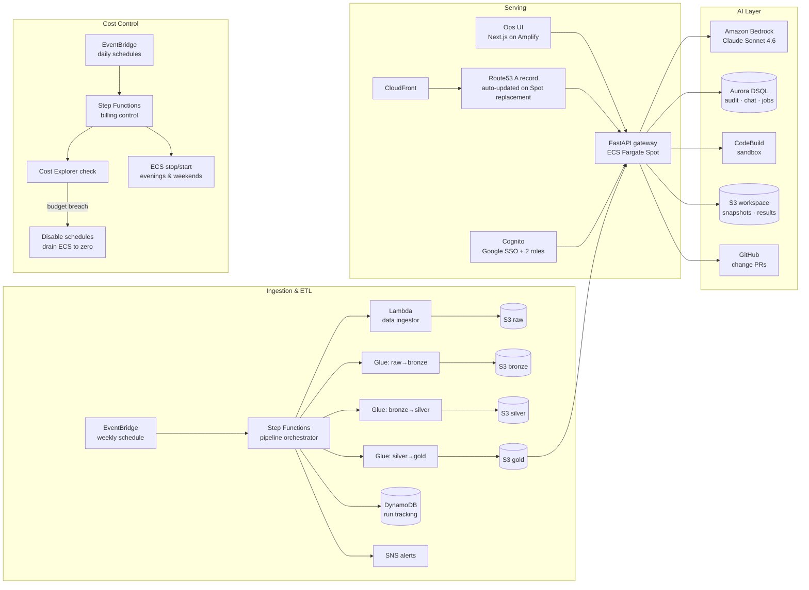

Full design detail: [docs/ARCHITECTURE.md](docs/ARCHITECTURE.md) · Interactive version: [architecture map](https://aloofancient.github.io/stratum-showcase/stratum-architecture.html)

## The system, running

### Data pipeline

The weekly pipeline state machine — Lambda ingestion, three Glue stages, tracking and notification hooks, with failure paths converging on a notifier:

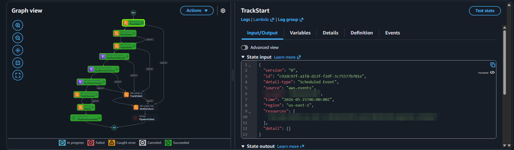

Every run opens and closes with an SNS email — start notification, then a success summary with per-symbol ingestion counts and total duration:

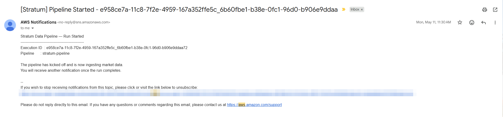
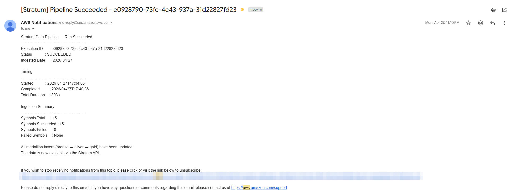

### Gateway API

OpenAPI-documented FastAPI gateway: gold-layer data, pipeline runs, admin-only ops actions, access management and the AI routes, all behind Cognito access tokens and two roles:

Show the full endpoint list (Swagger UI)

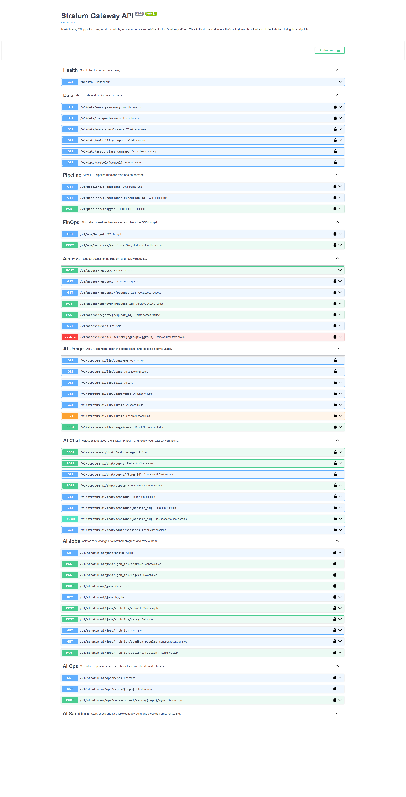

New users request access; an admin approves or rejects it in the ops UI and the requester gets an email:

### Ops UI and Ops Chat

A Next.js UI (chat, status, approvals, activity, admin usage, change pipeline) signed in with Google SSO. Ops Chat answers operational questions by calling real, read-only AWS tools — here, summarizing recent pipeline executions:

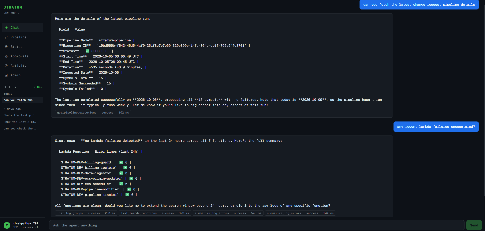
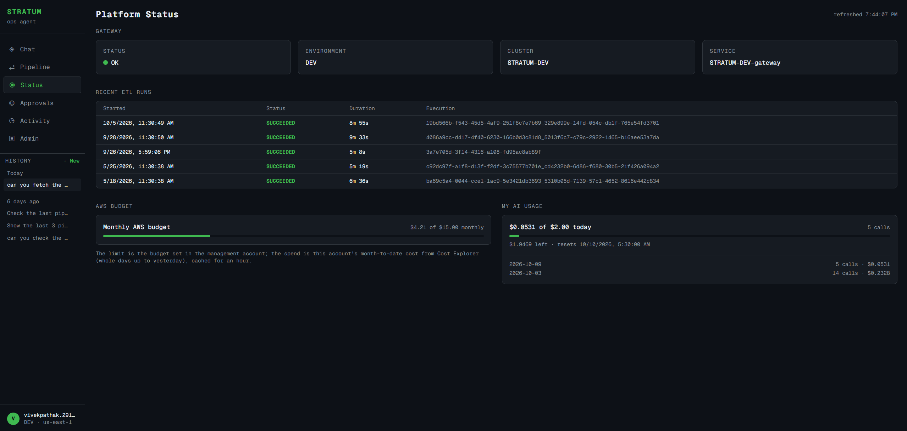

Admins see every AI call, with tokens, cost and per-user spend against the daily limits:

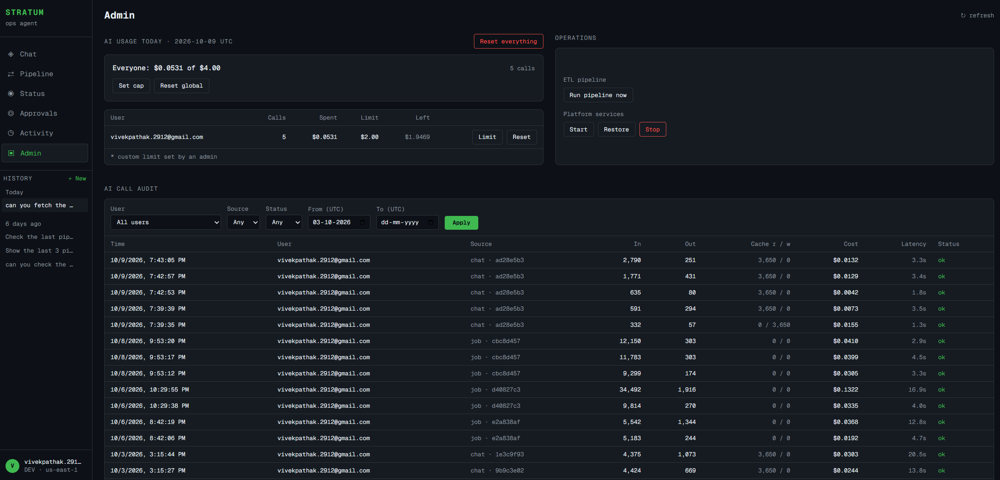

### Change pipeline

A user files a change request; an admin approves it; the pipeline runs step by step and raises a PR. The job page shows each step's status, tries, AI tokens, errors and sandbox results:

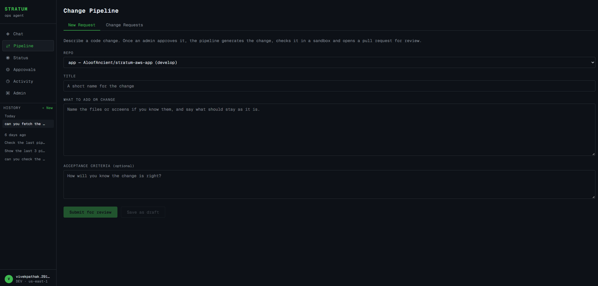
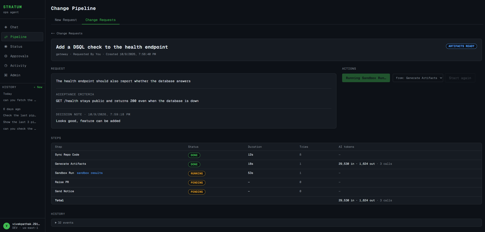
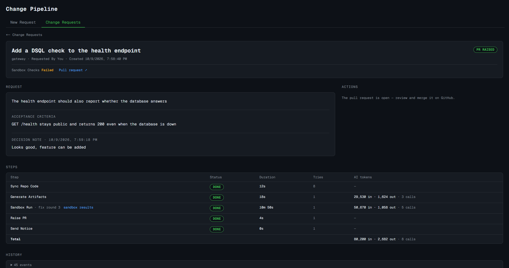

The result is an ordinary pull request with the build evidence in its description, waiting for a human review:

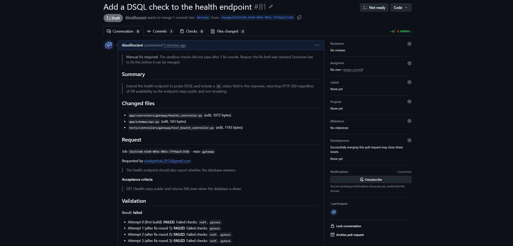

### Billing circuit breaker

One Step Functions router handles all cost operations — the `action` field (or its absence) picks the branch: daily Cost Explorer check, scheduled stop/start, or restore:

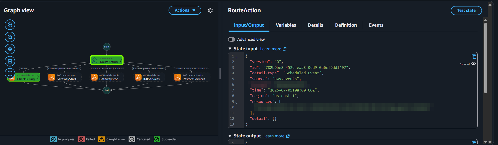
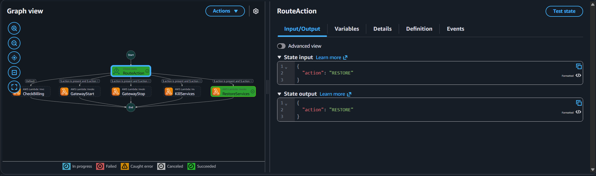

On budget breach it alerts, disables every scheduled rule except its own, and drains ECS to zero; restore is a single state-machine execution:

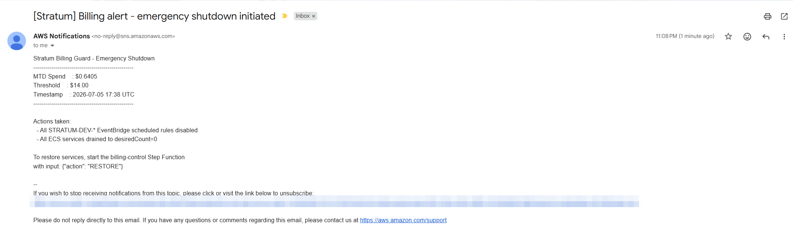
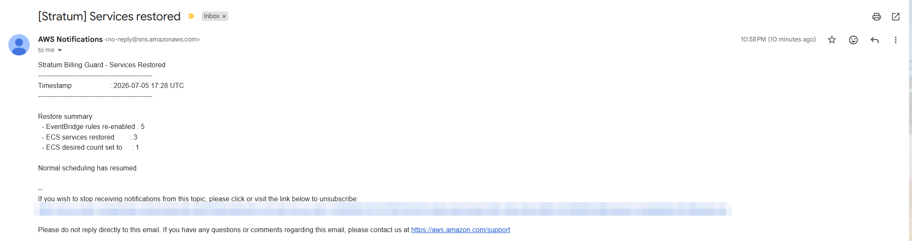

## Tech stack

**AWS:** Glue, Lambda, Step Functions, S3, ECS Fargate Spot, ECR, EventBridge, DynamoDB, Aurora DSQL, SNS, SES, Cognito, CloudFront, Route53, Amplify, CodeBuild, Bedrock, Cost Explorer, CloudWatch, SSM Parameter Store
**Languages & frameworks:** Python, PySpark, FastAPI, TypeScript, Next.js, OpenAPI
**IaC & CI/CD:** Terraform (HCP Terraform), GitHub Actions, branch-per-environment promotion
**Data:** Parquet, medallion (raw/bronze/silver/gold) layering, SQL migrations on Aurora DSQL
**AI:** Claude Sonnet 4.6 on Amazon Bedrock (Converse API, tool use, prompt caching), read-only tool registry, planner/author code generation, per-call cost and usage audit

## Design decisions worth stealing

1. **No ALB (~$16/mo saved):** CloudFront → Route53 → Fargate task public IP, with an ECS-task-state-change EventBridge rule triggering a Lambda that re-points the A record whenever Spot replaces the task.
2. **The data API reads S3 gold directly — no database in the serving path.** Parquet + date-partitioned prefixes are enough; the gateway resolves the latest partition at query time.
3. **Cost control as a state machine:** one Step Functions router handles scheduled stop/start, daily budget checks, and manual restore — the payload's `action` field (or its absence) picks the branch.
4. **Serverless SQL only where SQL is needed:** audit, chat and job data go to Aurora DSQL (idle cost $0, free tier); the ETL side stays on S3 and DynamoDB.
5. **The chat can read, never write:** Ops Chat tools are read-only by construction; anything that changes infrastructure is an explicit admin endpoint a person triggers.
6. **AI changes ship as PRs, never as merges:** generated code passes path and output guards, a sandbox running the repo's own checks, and a human review before it lands.
7. **Resume by re-running:** every pipeline step is safe to repeat, so recovery after a deploy or crash is just running the action again.

---

*Built and operated by [Vivek Pathak](mailto:vivekpathak.2912@gmail.com) — Lead Data Engineer (AWS · Python · PySpark · Terraform). Open to global remote roles.*
