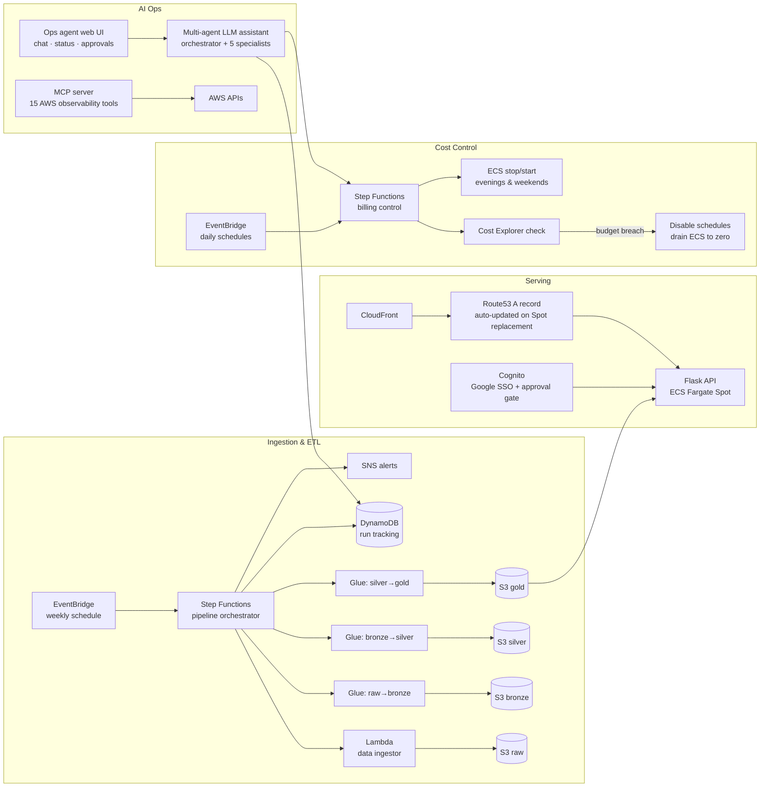
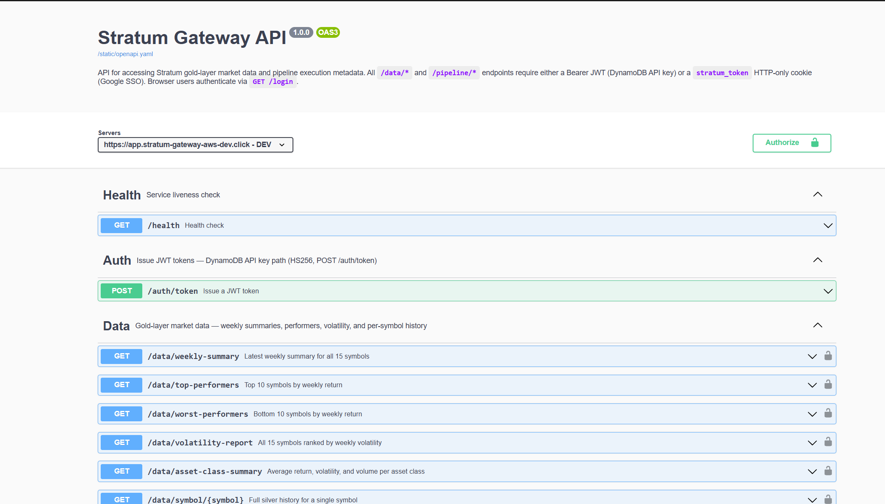
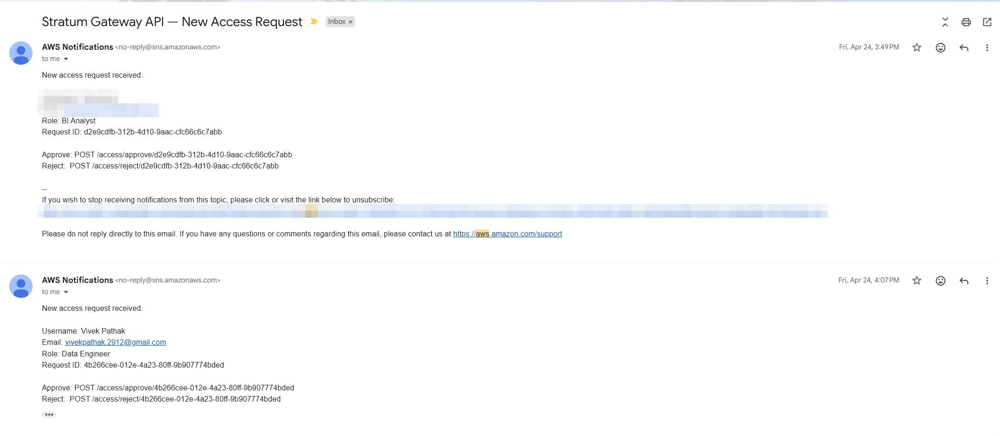
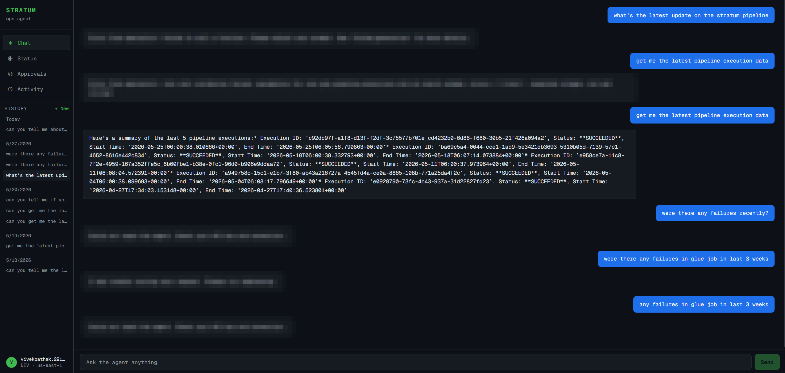
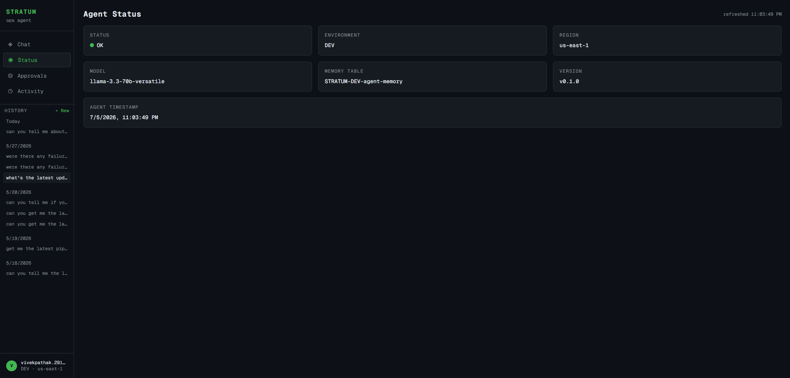
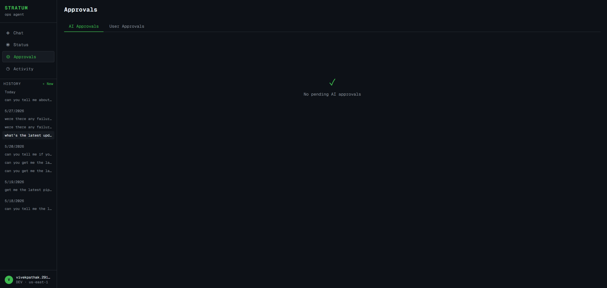
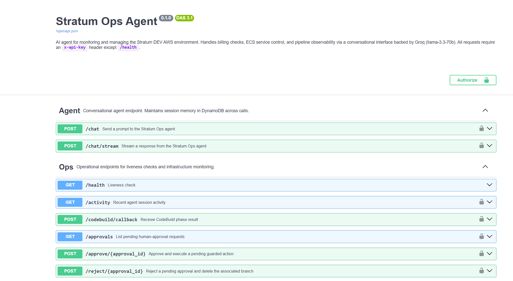

# STRATUM — Serverless Market-Data Platform on AWS

An end-to-end **medallion data pipeline** (raw → bronze → silver → gold) that ingests financial market data weekly, transforms it through three Glue ETL stages, and serves it via a Flask REST API on ECS Fargate Spot — **designed for near-zero idle cost**, operated by an **AI agent layer**, and managed 100% with Terraform.

> **Source code:** the application repo is private; this repo documents the architecture, design decisions, and the running system. Code walkthrough available on request — [vivekpathak.2912@gmail.com](mailto:vivekpathak.2912@gmail.com)

> **Live demo:** [app.stratum-gateway-aws-dev.click/docs](https://app.stratum-gateway-aws-dev.click/docs) — available weekday business hours (UTC). The infrastructure deliberately scales to zero outside those windows; that's the cost engineering working as designed, not an outage.

> **Interactive architecture map:** [explore the full AWS architecture](https://aloofancient.github.io/stratum-showcase/stratum-architecture.html) — clickable diagram of every service and data flow.

## Highlights

- **Medallion architecture, fully serverless** — EventBridge-scheduled Step Functions orchestrate a Lambda ingestor and three sequential Glue ETL jobs; Parquet on S3; DynamoDB execution tracking; SNS notifications at every stage.
- **Aggressive cost engineering** — no ALB, no NAT Gateway, no RDS. CloudFront fronts a Fargate Spot task whose public IP is kept current in Route53 by an event-driven Lambda. Services auto-stop evenings and weekends. A **billing circuit breaker** checks Cost Explorer daily and, on budget breach, disables all schedules and drains ECS to zero — with a one-action restore.
- **Real auth, documented API** — Google SSO via Cognito Hosted UI with an approval gate, plus JWT/API-key auth for programmatic access. OpenAPI spec is the source of truth for every endpoint.
- **AI operations layer** — a multi-agent LLM assistant (orchestrator + 5 specialists, with model fallback chains) monitors pipeline runs, spend, and infra health through a chat UI with human-in-the-loop approval guardrails. A companion **MCP server exposes 15 AWS observability tools** to AI clients.
- **100% infrastructure as code** — Terraform via HCP Terraform, with branch → environment CI/CD mapping (`develop → DEV`, `release → UAT`, `master → PROD`). No hardcoded resource names; everything resolves through SSM Parameter Store at deploy time.

## Architecture

Full design detail: [docs/ARCHITECTURE.md](docs/ARCHITECTURE.md) · Interactive version: [architecture map](https://aloofancient.github.io/stratum-showcase/stratum-architecture.html)

## The system, running

### Data pipeline

The weekly pipeline state machine — Lambda ingestion, three Glue stages, tracking and notification hooks, with failure paths converging on a notifier:

Every run opens and closes with an SNS email — start notification, then a success summary with per-symbol ingestion counts and total duration:

### API gateway

OpenAPI-documented Flask API serving gold-layer data (weekly summaries, top/worst performers, volatility, per-symbol history), with dual auth paths — JWT for programmatic access, Google SSO for browser users:

New-user access requests arrive as SNS notifications with approve/reject actions:

### AI ops agent

A web UI (chat, status, approvals, activity) in front of the multi-agent assistant. The agent answers operational questions by calling real AWS tooling — here, summarizing recent pipeline executions from DynamoDB:

Sensitive actions (service restores, budget changes, PR creation) require explicit human approval before they execute:

The agent service itself is OpenAPI-documented like everything else:

### Billing circuit breaker

One Step Functions router handles all cost operations — the `action` field (or its absence) picks the branch: daily Cost Explorer check, scheduled stop/start, kill, or restore:

On budget breach it alerts, disables every scheduled rule except its own, and drains ECS to zero; restore is a single state-machine execution:

## Tech stack

**AWS:** Glue, Lambda, Step Functions, S3, ECS Fargate Spot, ECR, EventBridge, DynamoDB, SNS, Cognito, CloudFront, Route53, Cost Explorer, CloudWatch, SSM Parameter Store
**Languages & frameworks:** Python, PySpark, Flask, OpenAPI
**IaC & CI/CD:** Terraform (HCP Terraform), branch-per-environment promotion
**Data:** Parquet, medallion (raw/bronze/silver/gold) layering
**AI:** Groq (Llama 3.3 / 3.1 fallback chains), Model Context Protocol (MCP), multi-agent orchestration with human-in-the-loop guardrails

## Design decisions worth stealing

1. **No ALB (~$16/mo saved):** CloudFront → Route53 → Fargate task public IP, with an ECS-task-state-change EventBridge rule triggering a Lambda that re-points the A record whenever Spot replaces the task.
2. **The API reads S3 gold directly — no database in the serving path.** Parquet + date-partitioned prefixes are enough; the API resolves the latest partition at query time.
3. **Cost control as a state machine:** one Step Functions router handles scheduled stop/start, daily budget checks, and manual restore — the payload's `action` field (or its absence) picks the branch.
4. **Guardrails for AI actions:** any sensitive agent action writes a pending-approval record with a TTL and requires explicit human approval before executing.

---

*Built and operated by [Vivek Pathak](mailto:vivekpathak.2912@gmail.com) — Lead Data Engineer (AWS · Python · PySpark · Terraform). Open to global remote roles.*
